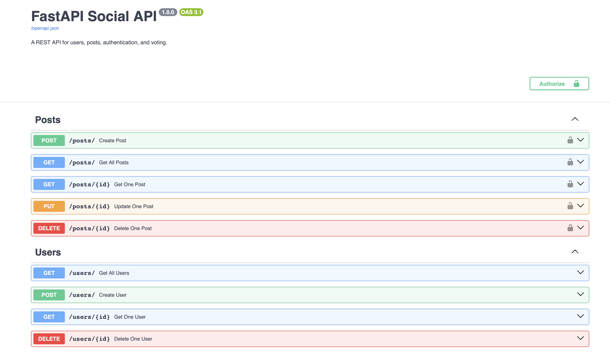
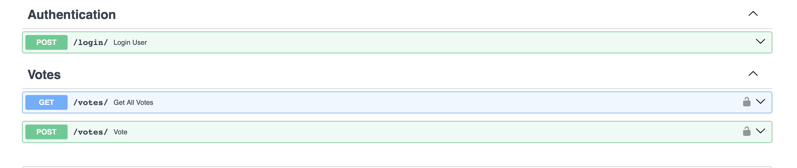
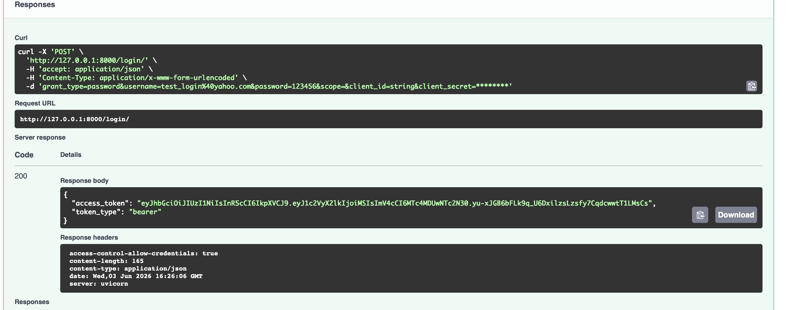
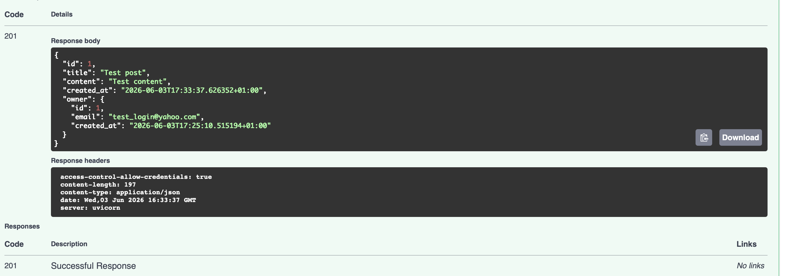

# FastAPI Social API


A production-ready RESTful social media backend API built with FastAPI, PostgreSQL, SQLAlchemy, and JWT authentication. The application is deployed on Render and uses a cloud PostgreSQL database hosted on Neon.

This project allows users to register, authenticate using JWT tokens, create posts, vote on posts, and interact with a PostgreSQL database.

## Live API

🔗 https://fastapi-social-api-11q7.onrender.com

## Swagger Documentation

📖 https://fastapi-social-api-11q7.onrender.com/docs

## 🚀 Quick Start Guide

To test the API through Swagger UI, follow these steps:

### 1. Create a User Account

Use the `POST /users` endpoint to create a new user account.

### 2. Authorize

Click the **Authorize** button at the top of the Swagger UI.

Enter:

- username: your email address
- password: your password

Then click **Authorize**.

Swagger will automatically obtain and use a JWT access token for all protected endpoints.

### 3. Test Protected Endpoints

After authorization, you can access protected endpoints such as:

- Create Post
- Update Post
- Delete Post
- Vote on Posts

All protected endpoints require authentication.


## Features

- User registration
- JWT Authentication
- Login system
- Create, update and delete posts
- Vote system
- Ownership protection
- PostgreSQL database
- SQLAlchemy ORM
- Alembic migrations
- CORS support
- Environment variable configuration

---

## 🛠️ Tech Stack

- 🐍 Python
- ⚡ FastAPI
- 🐘 PostgreSQL
- 🗄️ SQLAlchemy
- 🔄 Alembic
- 🔐 JWT Authentication
- ✅ Pydantic
- 🚀 Uvicorn
- ☁️ Neon Database
- 🌐 Render

## ☁️ Deployment

- Backend deployed on Render
- PostgreSQL database hosted on Neon
- Database schema managed with Alembic migrations
- Interactive API documentation available via Swagger/OpenAPI

Live API:
https://fastapi-social-api-11q7.onrender.com

Swagger Docs:
https://fastapi-social-api-11q7.onrender.com/docs

## Production Deployment

- Backend deployed on Render
- PostgreSQL database hosted on Neon
- Environment variables managed securely through Render
- Database migrations managed using Alembic
- Interactive API documentation generated with Swagger/OpenAPI

## 🔒 Security Features

- JWT-based authentication
- Password hashing using Argon2
- Protected routes with token validation
- Ownership checks for post updates and deletions
- Environment variables for sensitive configuration

  ## 🏗️ Architecture

Client
   ↓
FastAPI
   ↓
SQLAlchemy ORM
   ↓
PostgreSQL (Neon)

## Project Structure

```
FastAPI_Social_API/
│
├── app/
│   ├── routes/
│   │   ├── auth.py
│   │   ├── posts.py
│   │   ├── users.py
│   │   └── votes.py
│   │
│   ├── models.py
│   ├── schemas.py
│   ├── oauth2.py
│   ├── config.py
│   ├── utils.py
│   ├── database.py
│   └── main.py
│
├── alembic/
├── requirements.txt
├── .gitignore
├── .env.example
└── README.md
```
## 📸 Screenshots

### Swagger UI Overview



### API Endpoints



### JWT Authentication



### Create Post


---
## Installation

### 1. Clone the repository

```bash
git clone https://github.com/VladM-Sashev/FastAPI_Social_API.git
cd FastAPI_Social_API
```

### 2. Create and activate a virtual environment

```bash
python -m venv venv
source venv/bin/activate
```

### 3. Install dependencies

```bash
pip install -r requirements.txt
```

## 4. Configure Environment Variables

Create a `.env` file in the project root:

```env
DATABASE_HOSTNAME=localhost
DATABASE_PORT=5432
DATABASE_NAME=fastapi_2026
DATABASE_USERNAME=postgres
DATABASE_PASSWORD=your_password

SECRET_KEY=your_secret_key
ALGORITHM=HS256
ACCESS_TOKEN_EXPIRE_MINUTES=30
```

⚠️ These are example values for local development only.

For production deployment, environment variables are managed securely through Render and the PostgreSQL database is hosted on Neon.
```


### 6. Start the application

```bash
uvicorn app.main:app --reload
```

### 7. Open API Documentation

```
http://127.0.0.1:8000/docs
```

## Database Migrations

This project uses Alembic for database version control.

To apply all migrations:

```bash
alembic upgrade head
```

To create a new migration:

```bash
alembic revision --autogenerate -m "migration description"
```

To apply the new migration:

```bash
alembic upgrade head
```


## API Documentation

Swagger UI:

```text
http://localhost:8000/docs
```

---

## Authentication

Protected routes require JWT token:

```text
Authorization: Bearer <token>
```

---
## What I Learned

Through this project I gained practical experience with:

- Building RESTful APIs using FastAPI
- Implementing JWT authentication and authorization
- Designing relational database schemas with PostgreSQL
- Managing database migrations using Alembic
- Using SQLAlchemy ORM for database operations
- Deploying production applications on Render
- Managing cloud databases with Neon
- Working with environment variables and secret management
- Publishing API documentation with Swagger/OpenAPI

  ## Project Purpose

This project was developed as part of my backend software engineering portfolio to demonstrate practical experience with:

- API development
- Authentication and authorization
- Database design
- Cloud deployment
- Production configuration

## Future Improvements

- Comments system
- Docker support
- WebSockets
- Redis caching
- React frontend
- Testing

---

## Author

Vladimir Merdzhanov
